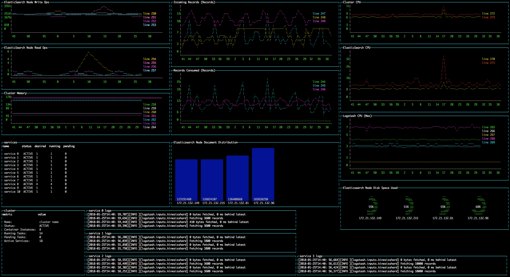
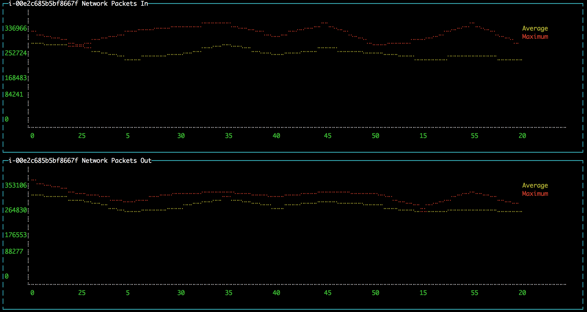

:toc: macro
:toc-title:
:toclevels: 99

toc::[]

image:https://travis-ci.org/localytics/exploranda.svg?branch=master["Build Status"]

## What Is This Thing?

This is a set of flexible patterns for visualizing complex systems using live data from arbitrary
sources. It defines a three-stage pipeline: 

  1. Dependencies
  2. Transformation
  3. Display

Each stage has an associated schema object. The `dependencies` schema object enumerates the data
required for the report and specifies how to get it. The `transformation` schema object specifies
the way to turn the dependency data into data that can be used by the display stage. The `display`
schema object specifies the way to present the data to the user. The core code of this tool executes
the pipeline according to the schemas, and shows you a display like this:



## Intended Uses and Design

I use this to build dashboards for systems I need to monitor and understand, a process
that I think of as a form of note-taking. This tool is different from other monitoring systems
in that it prioritizes flexibility over every other design consideration. For instance,
using this tool, you can build a report that displays several AWS CloudWatch metrics in
a graph. That is something that you can also do in CloudWatch, and it's probably easier 
to do in CloudWatch. But in this system, you can add another graph to the same report that
pulls data from an ElasticSearch cluster. Again, if you have a third-party monitoring system,
you can probably create a similar report there, and perhaps with a nice graph-builder UI.
But in this system, you can also add a box displaying a `tail` view of your actual log files,
or any other kind of data you can get from any source.

My experience has been that, although there is usually a better tool for any single data
modality (online graph-centric third-party monitoring tools, ELK, CLIs providing metrics to
systems like Docker and Redis), every complex system quickly reaches a point where understanding
it requires cutting _across_ those data modalities. I want to know the load average of my container-based
service, but I _also_ want to know which instance is hosting a particular container _and_ I 
want to keep an eye on certain domain-specific attributes, even if getting them requires some kind
of crazy Rube Goldberg contraption not supported by any existing monitoring system. And I want a
way to tie all these things together so nicely that all of my hard-won contextual knowledge of a
system is available to anyone in my organization who needs it, _especially_ when I'm on vacation. 

This overarching goal led to more concrete design priorities:

  1. What you choose to display and how you choose to display it are completely under
     your control.
  2. The core should focus on providing powerful, mid-level abstractions without assuming
     too much about a report-implementer's intent. In the `dependencies` stage, provide a simple
     pattern for describing what data to get. In the `transformation` stage. provide utility
     functions for common cases but allow implementers to ignore them. In the `display` stage,
     provide options that are simple, adequate, and optional.

## Getting Started

To install, clone this repo and run `npm install` in the root directory.

To create a full report, you need to create three data structures (one corresponding to each
of the three pipeline stages), pass them to the report executor, and execute the report. The
following example would display network data in and out of an EC2 instance on a pair of line
charts in the console:

```javascript
const _ = require('lodash');
const exploranda = require('./lib/reporter');
const {ec2MetricsBuilder} = exploranda.dataSources.AWS.ec2;
const instanceId = 'i-00e2c685b5bf8667f';
const apiConfig = {region: 'us-east-1'};

const reporter = new exploranda.Reporter();
reporter.setSchemas({
  // The dependencies section enumerates the data this report requires.
  dependencies: {
    // The functions like `ec2MetricsBuilder` are convenience functions that create
    // dependency objects. See the "Dependencies" section for a more complete description.
    instanceNetworkIn: ec2MetricsBuilder(
      // AWS account and region data
      apiConfig,
      // The value to pass as the MetricName parameter is "NetworkPacketsIn"
      {value: 'NetworkPacketsIn'},
      // The value to pass as the Statistics parameter is the array.
      {value: ['Average', 'Maximum']},
      // The value to pass as the Dimensions parameter is the array.
      {value: [{Name: 'InstanceId', Value: instanceId}]}
    ),
    instanceNetworkOut: ec2MetricsBuilder(
      apiConfig,
      {value: 'NetworkPacketsOut'},
      {value: ['Average', 'Maximum']},
      {value: [{Name: 'InstanceId', Value: instanceId}]}
    )
  },
  transformation: {
    [`${instanceId} Network Packets In`]: {
      type: 'CUSTOM',
      source: 'instanceNetworkIn',
      // Specify a function to transform the dependency into the shape needed by the output.
      // In this case, it's a structure that can be graphed.
      tableBuilder: ([ec2MetricPoints]) => {
        const times = _.map(ec2MetricPoints, (point) => point.Timestamp.getMinutes().toString());
        return [{
          title: 'Average',
          style: {line: 'yellow'},
          x: _.cloneDeep(times),
          y: _.map(ec2MetricPoints, 'Average'),
        }, {
          title: 'Maximum',
          style: {line: 'red'},
          x: _.cloneDeep(times),
          y: _.map(ec2MetricPoints, 'Maximum'),
        }];
      }
    },
    [`${instanceId} Network Packets Out`]: {
      type: 'CUSTOM',
      source: 'instanceNetworkOut',
      tableBuilder: ([ec2MetricPoints]) => {
        const times = _.map(ec2MetricPoints, (point) => point.Timestamp.getMinutes().toString());
        return [{
          title: 'Average',
          style: {line: 'yellow'},
          x: _.cloneDeep(times),
          y: _.map(ec2MetricPoints, 'Average'),
        }, {
          title: 'Maximum',
          style: {line: 'red'},
          x: _.cloneDeep(times),
          y: _.map(ec2MetricPoints, 'Maximum'),
        }];
      }
    },
  },
  display: {
    // Each top-level key specifies the visualizations of a particular type
    // to display. This one specifies all the line plots.
    lines: {
      [`${instanceId} Network Packets In`]: {
        // All the display objects have at least these four keys, specifying the
        // size and position of the visualizations in a 12 x 12 grid.
        column: 0,
        row: 0,
        rowSpan: 6,
        columnSpan: 12
      },
      [`${instanceId} Network Packets Out`]: {
        column: 0,
        row: 6,
        rowSpan: 6,
        columnSpan: 12
      },
    }
  }
});

reporter.execute();
```



A slightly expanded version of this report, which takes an instance ID as a command-line
parameter, is available in the `examples` directory. You can run it using:

```
node examples/netIO.js <instance id>
```

If the display has 'nonprintable character' blocks or question marks where other characters
should be, you might need to run it with:

```
LANG=en_US.utf8 TERM=xterm-256color node examples/netIO.js
```

If you only want to use this as a quick way to get JSON from APIs, you can use just
the `dependencies` pipeline stage without specifying either of the other stages, and your data
will be passed to a callback you provide. If you wanted, you could specify the first two stages
and get back structured data without using the builtin `display` stage. When a 
`display` isn't specified, the default is to log JSON to stdout, so it should be easy enough to
integrate with tools in other languages. An example of a report that logs all the instances
in an AWS account as a JSON array is at `examples/instancesJson.js`.

The next sections show in detail how each of the pipeline stages are specified.

## Dependencies

For the `dependencies` stage, you need to create an object representing your dependencies--the
actual data your report requires. This stage of the pipeline is shaped by the _sources_ of your
data and the requirements for accessing it.

The dependency object is a JavaScript Object. Its keys are the names of the data to be 
retrieved. Its values describe the data: where it comes from, what it looks like, and what 
parameters to use to get it. A very simple dependency object looks like this:

```javascript
const {kinesisStreams, kinesisStream} = require('exploranda').dataSources.AWS.kinesis;

const apiConfig = {region: 'us-east-1'};

const dataDependencies = {
  kinesisNames: {
    accessSchema: kinesisStreams,
    params: {apiConfig: {value: apiConfig}},
  },
  kinesisStreams: {
    accessSchema: kinesisStream,
    params: {
      apiConfig: {value: apiConfig},
      StreamName: {
        source: 'kinesisNames'
      }
    }
  }
};
```

This object specifies two pieces of data: an array of AWS Kinesis Stream names and an array
of Kinesis Stream objects returned from the AWS API. Each dependency defines some attributes:

`accessSchema` : Object (required) The AccessSchema object describing how to access the type of data the 
                 dependency refers to. The intent is that there should already be an AccessSchema object
                 for whatever type of dependency you want, but if there isn't, see the AccessSchema
                 sections at the end of this document.

`params` : Object. Parameters to fulfill the requirements of the AccessSchema or override defaults.
          the `params` object allows you to specify a static value, a runtime-generated value, or a 
          value computed from another dependency. For the keys to specify on the `params` object, look
          at the `params` and `requiredParams` fields on the `accessSchema` object, and any associated
          documentation. For instance, the accessSchema `kinesisStream` in the example above specifies
          the way to use the aws `describeStreams` method, so the `params` for that dependency can include
          any parameter accepted by that method. The `StreamName` is a required parameter, so it
          must be specified. Note that the `apiConfig` parameter is _always_ required. It is an object that
          will be merged with the default arguments for the aws api constructor (e.g.`new AWS.ec2(apiConfig)`)
          so it is the place to pass `region`, `accessKeyId`, `secretAccessKey`, and `sessionToken` arguments
          to override the defaults. This allows you to specify region and aws account to use on a 
          per-dependency basis.

`formatter`: Function. Function to format the result of the dependency. This parameter should ce used 
            extremely sparingly, because transforming output is properly the job of the `transformation` 
            stage. But in some cases a small change to the output format of a dependency is warranted. 
            For instance, the describeInstances AWS method always returns an array. If you filter for the
            ID of a single instance, it would make sense to use the formatter parameter to transform the
            result from an array of one instance to the instance record itself, for the convenience of
            referencing it elsewhere.

#### Dependency Params

The values on the `params` object can be used to specify a static value, a runtime-generated value, or
a value computed from the data returned in other dependencies. 

To specify a static value, set the `value` attribute to the value you want to use:

```javascript
const {kinesisStream} = require('exploranda').dataSources.AWS.kinesis;
const apiConfig = {region: 'us-east-1'};

const dataDependencies = {
  myKinesisStream: {
    accessSchema: kinesisStream,
    params: {
      apiConfig: {value: apiConfig},
      StreamName: {
        value: 'my-stream-name'
      }
    }
  }
};
```

To specify a runtime-generated value, set the `generate` attribute to a function that will generate the value
for the parameter. This example is a bit silly, but the ability to generate values is useful when a metrics API
needs to be given a time range: 

```javascript
const {kinesisStream} = require('exploranda').dataSources.AWS.kinesis;
const apiConfig = {region: 'us-east-1'};

const dataDependencies = {
  myKinesisStream: {
    accessSchema: kinesisStream,
    params: {
      apiConfig: {value: apiConfig},
      StreamName: {
        generate: () => `my-stream-name-${Date.now()}`
      }
    }
  }
};
```

To specify a parameter based on the result of another dependency, provide the source dependency name
as the `source` attribute, and an optional `formatter` function to transform the source value into
the shape required by the call. In the following example, the `kinesisStreams` dependency will get the
list of stream names received as the result of the `kinesisNames` dependency, filtered to only include
those that include the substring `foo`:

```javascript
const {kinesisStreams, kinesisStream} = require('exploranda').dataSources.AWS.kinesis;
const apiConfig = {region: 'us-east-1'};

const dataDependencies = {
  kinesisNames: {
    accessSchema: kinesisStreams,
    params: {apiConfig: {value: apiConfig}},
  },
  kinesisStreams: {
    accessSchema: kinesisStream,
    params: {
      apiConfig: {value: apiConfig},
      StreamName: {
        source: 'kinesisNames',
        formatter: (streamNames) => streamNames.filter((s) => s.indexOf('foo') !== -1)
      }
    }
  }
};
```

Note that `formatter` functions should be prepared to deal with cases when the data they expect is not
available.

### Dependency Automagic

The dependency step originated as an abstraction layer over AWSs APIs, which, while impressive
in their depth, completeness and documentation, can also be maddeningly inconsistent and edge-case-y.
Specifically, I wanted a simple way to get all of the objects associated with a particular AWS
resource type, like all kinesis streams or all the services in an ECS cluster, without always having to
account for the quirks and inconsistencies between the APIs for different services. So the dependencies stage
can do a couple of things you might not expect if you're familliar with the underlying APIs, such
as getting a list of resources even if they have to be fetched individually or in batches.

For example, take the case where you want to get the descriptions of every service in a cluster.
Your `dataDependencies` object could have as few as two entries:

```javascript
const {serviceArnsByCluster, servicesByClusterAndArnArray} = require('exploranda').dataSources.AWS.ecs;
const apiConfig = {region: 'us-east-1'};

const dataDependencies = {
  serviceArns: {
    accessSchema: serviceArnsByCluster,
    params : {
      apiConfig: {value: apiConfig},
      cluster: {
        value: 'my-cluster-name'
      }
    }
  },
  services: {
    accessSchema: servicesByClusterAndArnArray,
    params: {
      apiConfig: {value: apiConfig},
      cluster : {
        value: 'my-cluster-name'
      },
      services: {
        source: 'serviceArns'
      }
    },
  }
};
```

The data returned for these dependencies will include the ARN of _every_ service in the cluster
(`serviceArns`) and the description of _every_ service in the cluster (`services`).

If you're familliar with the AWS API, you might notice that the `listServices` method used to get
the ARNs of services in a cluster only returns up to 10 services per call. Part of the 
`serviceArnsByCluster` `accessSchema` object specifies this, and the framework automatically
recognizes when there are more results and fetches them. It also merges the results of all of the 
calls into a single array of just the relevant objects--the value gathered for the `serviceArns` 
dependency is simply an array of service ARN strings.

The other big feature of the dependency stage is the ability to handle parameters in the way
that is most convenient for the report implementer. For instance, the `serviceArns` array can be
arbitrarily long--it could be a list of 53 services in a cluster. But the `describeServices` AWS
API method requires that the `services` parameter be an array of no more than 10 service ARNs.
Here, the `servicesByClusterAndArnArray` `accessSchema` object includes this requirement, and the
framework internally handles the process of chunking an arbitrary number of services into
an appropriate number of calls. 

The general pattern of the `dataDependencies` object is that, for any type of resource, you can pass
an arbitrary array of the resource-specific "ID" value for that resource and expect to get back the
(full) corresponding array of resources without worrying about the specifics of parameterization or
pagination. Likewise, for "list" endpoints, you can expect to get back the full list of relevant 
resources. This frees you from having to understand the specifics of the AWS API, but does require
a little thought about how many results you expect a particular dependency to generate. When the AWS
API provides a mechanism for filtering on the server side, it's often a good idea to use it. And some 
`accessSchema` objects intentionally do not specify the way to get all of the results, such as the
CloudWatchLogs accessSchemas, which would probably need to fetch gigabytes or terabytes if they
tried to fetch everything. 

As an additional bonus, dependencies are fetched concurrently whenever possible, so load times tend 
not to be too bad. When given the choice between optimizing performance or optimizing ease-of-development,
however, I've consistently picked ease-of-development.

And speaking of ease-of-development, I also noticed that a lot of the `dataDependency` objects turn
out to be boilerplate, so most of them have associated builder functions that just take the parts
that usually change. The `dataDependency` above can also be implemented as:

```javascript
const {clusterServiceArnsBuilder, servicesInClusterBuilder} = require('exploranda').dataSources.AWS.ecs;
const apiConfig = {region: 'us-east-1'};

const dataDependencies = {
  serviceArns: clusterServiceArnsBuilder(apiConfig, {value: 'my-cluster-name'}),
  services: servicesInClusterBuilder(apiConfig,
    {value: 'my-cluster-name'},
    {source: 'serviceArns'}
  )
};
```

These builder functions are fairly ad-hoc at the moment and I'm loathe to introduce yet another
abstraction layer and data structure, so it may be best to regard those that exist as unstable.
However, it is often convenient to implement such builders yourself in the context of a specific
report.

## Transformation

The purpose of the transformation stage is to take the data as it was received and transform it into
the shape required by the display. The transformation stage schema is a JavaScript object whose keys are
the names of "tables" of data, and whose values specify the way to make the tables. There are some specific
table types available by shorthand (discussed below) but defining your own transformation is simple:

```javascript
const tables = {
  'My Instance CPU Usage': {
    type: 'CUSTOM',
    source: 'instanceCpuMetrics',
    tableBuilder: (cpuMetricDataPointArray) => {
      const times = _.map(cpuMetricDataPointArray, (point) => point.Timestamp.getMinutes().toString());
      return [{
title: 'Average',
         style: {line: 'yellow'},
         x: _.cloneDeep(times),
         y: _.map(cpuMetricDataPointArray, 'Average'),
      }, {
title: 'Maximum',
         style: {line: 'red'},
         x: _.cloneDeep(times),
         y: _.map(cpuMetricDataPointArray, 'Maximum'),
      }];
    }
  }
};
```

This table schema describes a single table called "My Instance CPU Usage". The source of the data in the table
is the `instanceCpuMetrics` dependency. The `tableBuilder` is a function that takes the array of data
point objects (which is what that dependency returns) and returns a data structure that can
be used to create a line plot by the console display library.

The `type` and `source` fields should be specified on every table description object. Depending on the `type`,
other fields may also be relevant.

`type` (String) : optional but suggested, defaults to `CUSTOM`. The type of the table. Valid types are listed
                  below. The `CUSTOM` type allows you to define your own transformation; other types specify
                  common transformations so that you don't have to. If you find yourself writing similar
                  custom transformations for a lot of tables and can think of a way to generalize them,
                  consider a PR to add a new type. Note that the builtin table types sometimes expect a specific
                  form of data as input--not every builtin can be used for every dependency.

`source` (String | Number | Object | Array) : required. The source of the data for the table. A string or
                  number value indicates a specific dataDependency, and the results of that dependency will
                  be passed as the sole argument to the `tableBuilder` function. If `source` is an array,
                  each element of the array indicates a dataDependency, and the `tableBuilder` function will
                  be passed an object with attributes whose keys are the dependency names and whose values
                  are the results of the dependencies. If `source` is an object, the object's values
                  will indicate the dataDependencies and the keys will be used as the keys for those
                  dependencies in the object passed to the `tableBuilder` function.

### Builtin Table Types

#### AVERAGE_MAX_LINE

This is a builtin table to format input data so that it can be used to make a line plot in the console
display library. Its table building method is nearly identical to the one in the example above, and it
expects that the `source` will be an array of data points returned by a CloudWatch metric call that
include the Maximum and Average Statistics. It does not require or notice any extra fields; the above
example could also have been written:

```javascript

const tables = {
  'My Instance CPU Usage': {
    type: 'AVERAGE_MAX_LINE',
    source: 'instanceCpuMetrics'
  }
};

```

This table type is meant to be used as a source for the `line` display type.

#### PROFILE

The `PROFILE` table type is for times when you have a single object and you want to display a two-column
table using its values--usually the 'vital stats' of an entity of interest like an ECS cluster. Given a
result object like:

```javascript

const result = {
  name: 'my cluster',
  containerInstances: 2,
  services: 1
};
```

you could specify a `PROFILE` table like:

```javascript

const tables = {
  'Cluster Profile': {
    type: 'PROFILE',
    source: 'clusterObject',
    rows: ['name', 'services', 'containerInstances']
  }
};
```

The `rows` field is the only extra field recognized by the `PROFILE` table type. It is an ordered list of
rows to include in the table. Each element in the `rows` array is used to specify a heading and a value 
for the row. If the array element is a string or number, the literal string or numeric value is shown as
the "heading" for that row in the table, and the value corresponding to that key on the source object is
shown as the value.

The array elements can also be specified as objects with `heading` and `selector` keys. In that case, the
`heading` is used as the heading to display, and the `selector` is used to get the value to display
beside that heading. If the `selector` is a string or number, it is treated as a path on the source object.
If it is a function, it will be passed the source object and its return value shown in the table.

#### ROW_MAJOR

The `ROW_MAJOR` table type is similar to the `PROFILE` table type, except that where the `PROFILE` table
type describes a two-column table whose rows come from the values of a single object, the `ROW_MAJOR`
table describes an n-column table where each row represents a different entity. This is the table type
to use when you want to present a list of services, for instance, and display the same data for each
of them in columns.

```javascript

const result = [
  {
    name: 'service1',
    tasks: 1,
    failures: 0
  },
  {
    name: 'service2',
    tasks: 1,
    failures: 0
  },
  {
    name: 'service3',
    tasks: 1,
    failures: 0
  }
];

const tables = {
  'Services': {
    type: 'ROW_MAJOR',
    fields: [
      {heading: 'Service Name', selector: 'name'}, 
      {heading: 'Running Tasks', selector: (item) => item.tasks}, 
      {heading: 'Failed Tasks', selector: 'failures'}
    ]
  }
};

```

The `fields` attribute is the only extra attribute recognized by the `ROW_MAJOR` table type; its format
is identical to the `rows` attribute format from the `PROFILE` table type. The difference is that here it
refers to columns.

## Display

The default display renderer is a wrapper around https://github.com/yaronn/blessed-contrib[blessed-contrib]
for displaying dashboards in the console. In order to use the display types provided by blessed-contrib,
the `transformation` step has to produce correctly-formatted data for the type of display specified. Below,
the individual types of display element and their data requirements are documented. The `display` object is
organized by the type of display element:

```javascript
const display = {
  markdowns: {
    'Instance logs': {
      column: 2,
      row: 9,
      rowSpan: 1,
      columnSpan: 5,
    }
  },
  tables: {
    'Instance Table Data': {
      column: 0,
      row: 9,
      rowSpan: 3,
      columnSpan: 2,
    },
  },
  donuts: {
    'Instance Disk Space Used': {
      column: 8,
      row: 8,
      rowSpan: 2,
      columnSpan: 4
    }
  },
  lines: {
    'Instance Network In': {
      column: 4,
      row: 3,
      rowSpan: 3,
      columnSpan: 4
    }
  },
  bars: {
    'Instance Disk Usage Distribution': {
      barWidth: 13,
      column: 4,
      row: 6,
      rowSpan: 3,
      columnSpan: 4
    }
  }
};
```
This display schema specifies one element of each type. The titles--the keys of the objects
within the element type sections--must exactly match the name of the table the element's data
comes from. Each display element specifies `column`, `row`, `rowSpan`, and `columnSpan` as 
integers between 0 and 12. These values control where on the screen the element is displayed,
and its size (on a 12x12 grid), and are consistent for all display types.  Some of the display
types recognize other parameters, but none are required.

Each of the following examples of display element types includes an example of what the
data fed to that display element should look like. Note that these data structures should
be created in the `transformation` stage; there is no mechanism for shaping data in the 
`display` stage. The examples are provided here for reference.

### Display Element Types

#### markdown

This displays simple markdown-formatted text in a box. The data must be provided as
an array of strings. The first element in the array will not be displayed. This means
that you can use the `ROW_MAJOR` table type and specify a single field, and your data
will be displayed correctly without headings.

```javascript
const dataForMarkdown = [
  'heading', // will not be shown
  '2017-12-07T12:12:12.000 something happened' // this will be the first line shown
];
```
 
#### table

This displays a table with highlighted headers. The data must be provided as an array
of arrays of lines of data. The first element in the array must be the headers. Both 
the `ROW_MAJOR` and `PROFILE` table types structure data correctly for table display.

```javascript
const tableData = [
  ['Name', 'Services'],
  ['cluster1', 12]
];
```

#### donut

Each `donut` element specifies one or more donut gauges, visually displaying a percentage.
The data must be provided as an array of elements that can be passed to the blessed-contrib
donut element. The percentage should be specified as a number between 0 and 100. When specifying
multiple gauges, take care to sort the array in the transformation stage, because many APIs
will return your data in a different order from one call to the next, and it's distracting
for the gauges to get reordered when the screen refreshes.

```javascript
const donutData = [
  {percent: 99, label: 'CPU', color: 'magenta'}
];
```

#### line

Each `line` element specifies one line chart, on which one or more lines can be drawn. The lines
must be provided as an array of objects that can be passed to the blessed-contrib line element.
You may see misalignments between lines in the same chart if the data for the different lines
has different numbers of elements--the only solution is to up- or downsample the data until the
different lines are sampled at the same frequency. So far I've found this to be a small enough
issue that I haven't bothered.

```javascript
const lineData = [
  {
    title: 'Instance CPU',
    x: ['0', '1', '2'], // must be strings
    y: [45, 45, 56],
    style: {line: 'white'}
  }
];
```

#### bar

Each `bar` element specifies one bar chart, on which one or more bars can be drawn. The bar data
must be provided as an object that can be passed to the blessed-contrib bar element. When specifying
bars, take care to sort their order in the transformation stage, because many APIs
will return your data in a different order from one call to the next, and it's distracting
for the bars to get reordered when the screen refreshes.

```javascript
const barData = {
  titles: ['instance 1 disk', 'instance 2 disk'],
  data: [45, 56]
};
```

#### stackedBar

Each `stackedBar` element specifies a bar chard with stacked bars of different colors. The bar data
must be provided as an object that can be passed to the blessed-contrib stacked-bar element, with the
exception that the `barBgColor` array should co on the same object as the `data` array. Remember to sort
the data before returning it.

```javascript
const stackedBarData = {
  barBgColor: ['red', 'yellow', 'green'], // colors for stack sections, bottom to top
  barCategory: ['host1', 'host2'], // x-axis labels
  stackedCategory: ['bad', 'less bad', 'probably fine'], // labels for the stack segments
  data: [[0, 2, 3], [4, 0, 0]], // barCategory-major
};
```

## Creating new AccessSchema objects

AccessSchema objects live one step closer to the center of this library than the 
dependency, transformation, and display objects, and so they are also one step more
general, re-usable, and, unfortunately, complicated. This tool consists of a very
small core of relatively gnarly code (`libs/composer`, `libs/reporter`, 
`libs/awsRecordCollector`, `libs/dashboard`) which is in total about a third of the
size of this documentation file. Surrounding that is a layer of standard-but-numerous
accessSchema objects, which are themselves more complex than I would like a casual
user to have to deal with. The design goal is that it should be simple for many
people working in parallel to add any accessSchema objects as they are needed, and
more casual users should usually find that the accessSchema object they want already
exists or can be created and merged quickly.

Right now there are three types of AccessSchema objects: AWS, GCP, and request-based. At the top level,
each `accessSchema` must have a `dataSource` attribute identifying the data access function that
knows how to fulfill requests using that schema; other than that, the layout of each
type of accessSchema is determined by the requirements of the data access function.

### SDK Access Schemas

The intent of the SDK accessSchema is to describe everything needed to interact with
an SDK method. For examples of AWS AccessSchema objects, look in the 
`lib/dataSources/aws` directory. For examples of the GCP AccessSchema objects,
look in the `lib/dataSources/gcp` directory.

#### Simple fields

`dataSource` (required) : must be exactly `'AWS'` for AWS AccessSchemas
and exactly `'GOOGLE'` for GCP AccessSchemas.

`name` (required) : A name expressing the data source, used in error messages

`apiMethod` (required) : the API method whose interface this accessSchema describes.
This field differs between the AWS and GCP AccessSchemas. For AWS, it is the string
name of the method on the relevand SDK object. For GCP, it is an array with the
parts of the API namespace after the first. For instance, the apiMethod
for the `compute.instanceGroups.list` API is `['instanceGroups', 'list']`

`incompleteIndicator` (optional) : a way to tell if the results from a call to this 
API are incomplete and we need to get more. If this is a string or number, it is
treated as a path on the result object (e.g. if `nextToken` exists, this result is
incomplete). If specified as a function, it will be passed the result object and
can return a truthy value to indicate that this result is incomplete.

`nextBatchParamConstructor` (optional) : a function to construct the parameters
for the next call to the API when the `incompleteIndicator` shows that this is a
partial result. This function is called with two arguments: the parameters used
for the most recent call and the result of the most recent call. its return value
should be the parameters to use in the next call. This field must be specified if
the `incompleteIndicator` is specified.

`mergeOperator` (optional) : Function to merge the results of multiple successive
calls to get the complete results. This function is called after _every_ call after
the first with the running total of the results as the first argument and the current
set of results as the second. If this function is not specified, `lodash.concat` is used.
Note that the `mergeOperator` function is only used to merge responses in the case where
the response from a _single_ call is incomplete, and further calls must be made to
get the remainder of the results. In cases when more than one call needs to be made
based on the params provided (including, for now, if the params need to be chunked into
smaller groupings), the results of those calls will be merged with the `mergeIndividual`
function.

`onError` (optional) : In extremely rare cases, SDK APIs require you to make a call before
you know whether it can succeed. The only example of this so far is the AWS `getBucketPolicy` S3
method, which can return a `NoSuchBucketPolicy` error when a bucket policy does not exist, even
though there is no other way to check for the policy's existence beforehand. In this kind of situation
you can provide an `onError` field in the accessSchema, which will be passed the error and
result of the SDK call. This parameter must return an object with `err` and `res` fields, which
will be treated as if they were the error and response that had been returned by the API.

`mergeIndividual` (optional) : Function to merge the results of multiple calls to an API
_not_ triggered by the `incompleteIndicator`. For instance, if you pass an array of IDs
as a parameter to a dependency whose accessSchema only takes a single ID, `mergeIndividual`
will be used to merge the results of the individual calls to the API for each ID. But if
you pass no params to a dependency whose accessSchema lists a resource, and the result from
the API is incomplete and requires subsequent requests to get all of the results, the results
of the list calls will be merged with `mergeOperator`. 

The `mergeIndividual` function will be passed an array of response arrays from successive requests
to the resource. The default `mergeIndividual` behavior is [`_.flatten`](https://lodash.com/docs/4.17.5#flatten).
To preserve the array of arrays, use `_.identity` or `(x) => x`.

#### The `namespaceDetails` field

The `namespaceDetails` member contains information about the namespace on the
SDK where the apiMethod specified is found. It has two fields:

`name` (String, required) : the exact SDK namespace, e.g. `'EC2'` for AWS or `compute` for GCP.

`constructorArgs` (Object, required) : defaults to pass to the namespace constructor.
Right now this almost always includes `region: 'us-east-1'`, but this will change
as the region will need to be configurable. The API version can also be specified.

#### The `value` field

The `value` field describes the type of value returned by this API. This is required
internally for building parameters for API calls and consolidating the results. It
is also used to construct clear error messages.

`path` (required) : (String|Number) or function to get the _actual_ objects off of
the results returned from the API, which invariably returns the actual cluster /
instances / AMIs / whatever wrapped in some kind of API bookkeeping struct.

`sortBy` (optional) : a selector or function to use to sort the results.

#### The `params` field

This field consists of literal key-value pairs to use as default values in calls
to this endpoint. Do not confuse this with the `params` specified on the dependency
objects--those are _not_ literal values, and need to specify more metadata.

#### The `requiredParams` field

This object specifies the values that _must_ be filled in at runtime in order for
a call to this SDK method to succeed. The keys on this object are the keys that will
be passed to the method. The values on this object provide metadata about how to 
treat the values provided at runtime.

`max` (Number) : if `shape` is ARRAY, but the length of the array is limited by the SDK,
`max` specifies the maximum number of values allowed per call. 

`defaultSource` (AccessSchema) : in the fairly rare cases where you have a `describe`
API that takes an ID value and returns an object, _and_ there exists a `list` API that
has no required parameters and returns a list of the IDs, you can attach the `accessSchema`
of the `list` API as the `defaultSource` of the ID `requiredParam` object on the `describe`
API. Then, if no specific parameter is specified for the ID in the `dependencies` stage, 
the accessSchema will get the full list of IDs from the `list` API and then use them to get
the full list of resources.

`detectArray` (Function) : A function that, when passed the parameter vaue, returns `true`
if the value is actually an array of parameters for a series of separate calls rather than
a parameter for a single call. For instance, the CloudWatch metrics method requires a set
of "Dimensions" for each call. These Dimensions are specified as an array of Dimension
objects. This makes it impossible for the code doing the requests to determine from the
parameters whether what it sees is "an array of Dimension objects, to be sent as the
Dimensions parameter in a single call" or "an array of _arrays_ of Dimension objects,
meant to be the arguments to _multiple_ calls".

### Request AccessSchema Objects

This accessSchema type describes a generic way to talk to HTTP / HTTPS APIs. It is
much less mature than the SDK schema and should be expected to change. For an example
of its use, see `lib/dataSources/elasticsearch/elasticsearch.js`

#### Simple fields

`dataSource` (required) : must be exactly `'REQUEST'`

`generateRequest` (required) : Function to generate the request. Will be passed the 
params specified on the dependency object as the only argument.

`ignoreErrors` (boolean) : if truthy, will simply return undefined on errors.

`defaultResponse` : if `ignoreErrors` is truthy, a response to use when there is an
error; a sensible empty value.

`incomplete` (Function) : detect if the response is incomplete. Analagous to 
`incompleteIndicator` from the SDK access schema.

`mergeResponses` (Function) : merge the responses of successive calls when the results
required more than one call. Analagous to `mergeOperator`.

`nextRequest` (Function): generate the parameters for the next request if the current
results are incomplete. Analagous to `nextBatchParamConstructor`.
